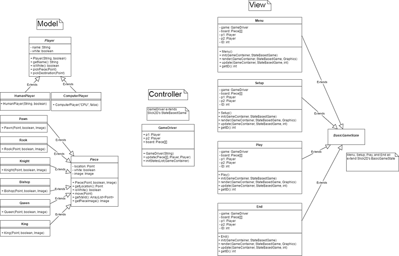
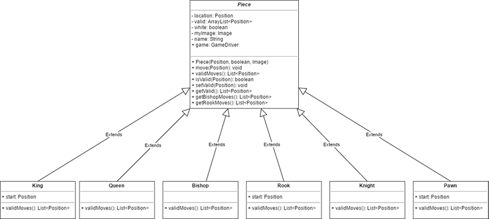

## Final Software Architecture

##### Model-View-Controller Architecture

##### Abstract Classes

## Design Patterns

* List of Design Patterns
    * Benefits of patterns
* Strategy
    * Allows for one concrete object to have the option of many different functionalities

## Highlights

The one thing I liked best about my design and implementation

## What I Learned

What I learned from creating this project

Screenshots of project stages
